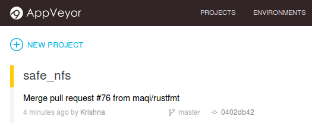
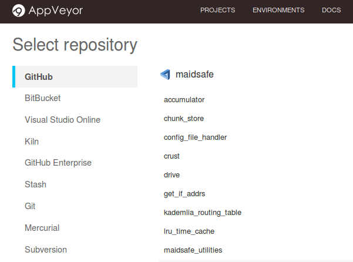
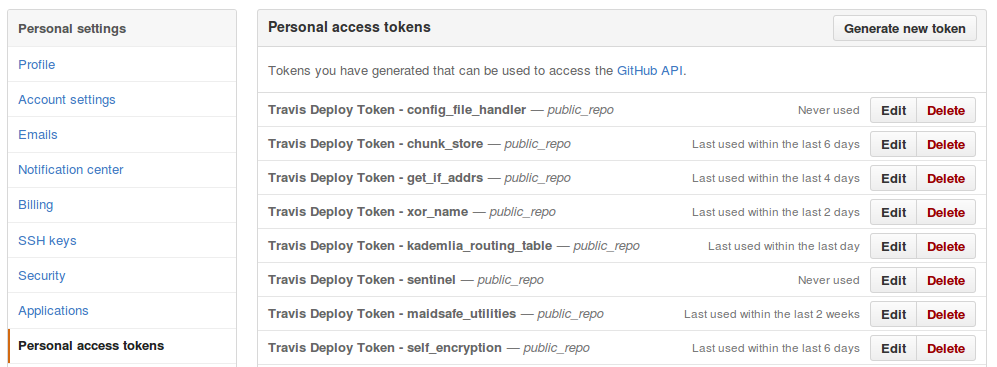
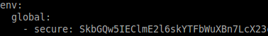
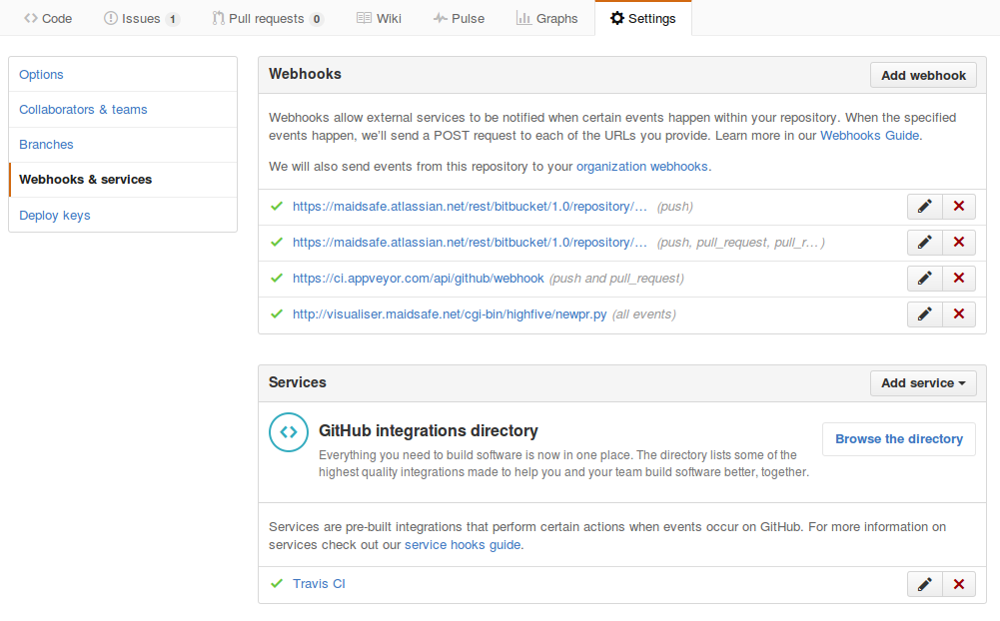
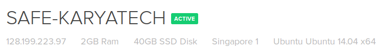
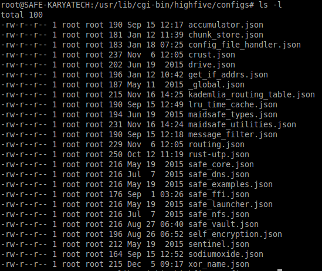
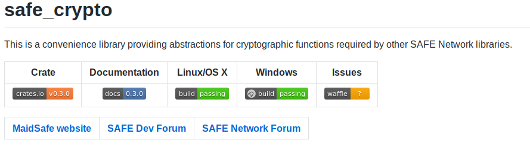
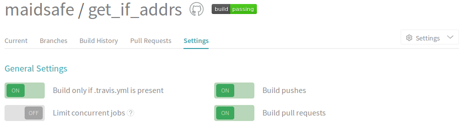

## Add a New GitHub Repository - QA Steps

New GitHub repo created? Then this document should walk you through the QA steps to standardise your repo, alongside all the other MaidSafe GitHub repositories. For steps and tools please use the MaidSafe-QA user unless instructions specify otherwise.

### Fork the New Repository

While logged into GitHub under your own account, fork the new repo and clone it locally.

### Login to GitHub as MaidSafe-QA

Log out of your own account and log back in as the MaidSafe-QA user.

*At this stage you need to request temporary GitHub "Admin" privileges from Fraser, Viv or David.*

### Add Repository to Travis

Login to [Travis](https://travis-ci.org/), sync account, find the new repository you want to add and flick the switch to on.


### Add Repository to AppVeyor

Login to [AppVeyor](https://ci.appveyor.com/login) and select  `+ NEW PROJECT`



Then select the repository you would like to add



Add appveyor.yml and .travis.yml scripts to new repository.

From another [MaidSafe GitHub repository](https://github.com/maidsafe), copy and add the `appveyor.yml` and `.travis.yml` files to the root of your newly-forked local clone of the new repository. The `.travis.yml` will require minor tweaking (more of which in the following steps) especially creating and updating the secure token, which is used to upload rust documentation.

### Give Travis Permissions

While still logged into GitHub as the MaidSafe-QA user, go to settings and select "Personal access tokens". Now click `Generate new token` and create a new "Travis Deploy Token - <new repo name>"



and limit scopes to `public_repo` as shown below


Once you have clicked on "Generate token", copy the output as you will not see it again.

[Install Travis gem](https://github.com/travis-ci/travis.rb#installation) to encrypt secure GitHub access

Run this, where `<YOUR_TOKEN>` is the one we copied in the previous step.

`travis encrypt -r maidsafe/<new_repo> GH_TOKEN=<YOUR_TOKEN>`

Edit the `.travis.yml` file you added to the new repo and replace the long string in the line `-secure:` with the output you have just generated - example of what this looks like is below (the string has been shortened in this image).



If you are not at this point going to update the repository's `README.md` then you can push all your local changes upstream and issue a PR to add them to the main repository.

### Webhooks - Add Highfive

Go to the project's settings (the `maidsafe` fork - not your fork) *> Settings > Webhooks & services > Add webhook*

The Payload URL is

```
http://visualiser.maidsafe.net/cgi-bin/highfive/newpr.py
```




### Highfive Backend Configuration

SSH (details in private assets GitHub repository) to the droplet hosting Highfive



Navigate to `/usr/lib/cgi-bin/highfive/configs/`



create a new `<repository_name>.json` file (copy an existing .json file)


Edit the new `<repository_name>.json` file and update the maintainers' names.

The important section is "groups" - note that entries & file names are case sensitive.

### Add Coverage

Login to [coveralls.io](https://coveralls.io/) using the MaidSafe-QA GitHub account and click `RE-SYNC REPOS`


Click `ADD REPOS`


Flick the switch on your new repository


### Update New Repo's `README.md`



Above is a screenshot and below is a template, best take the markdown from another repository and edit to fit the purposes of the new repository.

# < repository_name >

[](http://maidsafe.net/applications) [](https://github.com/maidsafe/crust/blob/master/COPYING)


**Primary Maintainer:** < name > (< email_address >)

**Secondary Maintainer:** < name > (< email_address >)

Reliable peer-to-peer network connections in Rust with NAT traversal.

|Crate|Linux/OS X|Windows|Coverage|Issues|
|:---:|:--------:|:-----:|:------:|:----:|
|[](https://crates.io/crates/crust)|[](https://travis-ci.org/maidsafe/crust)|[](https://ci.appveyor.com/project/MaidSafe-QA/crust/branch/master)|[](https://coveralls.io/r/maidsafe/crust)|[](https://waffle.io/maidsafe/crust)|

|[API Documentation - master branch](http://maidsafe.net/crust/master)|[SAFE Network System Documentation](http://systemdocs.maidsafe.net)|[MaidSafe website](http://maidsafe.net)| [SAFE Network Forum](https://forum.safenetwork.io)|
|:------:|:-------:|:-------:|:-------:|


## Overview
< insert_overview >
## Todo Items
< insert_todo_items >

*In the above example the badges and links are for `crust` just for illustrative purposes*

One niggle worth noting for AppVeyor badges that has caught a few folk out: you need to grab the markdown for master branch badge - this can be found on the AppVeyor site in the new repo page under: *Settings > Badges* and is the 6th or last entry on the page see below.
This is the one that needs pasted into the project's `README.md` and the QA `README.md`


### Switch - Build only in .travis.yml / appveyor.yml is present - ON

Log into Travis and go to repository *> settings > general settings* and switch `ON` *Build only if .travis.yml is present* setting.



Log into Appveyor and go to repository *> settings > general* and tick the *Skip branches without appveyor.yml* and *Rolling builds* check boxes.


### Update QA readme.md

Finally add a new entry to https://github.com/maidsafe/QA/blob/master/README.md and issue a PR for this.

### Revoke Github "Admin" from MaidSafe-QA user

Once everything is complete, we need to revoke elevated privileges and reduce them back to "Write".

*Ensure `Owners` have "Admin" privileges and `Bots` and `Developers` have "Write" privileges.*

### Checklist to see if everything is ok:

* Did Travis run?
* Did AppVeyor run?
* Does Highfive allocate a reviewer for a PR?
* Do all the links and badges go to the correct places?
* On a successful merge to master did Travis create and publish the documentation?
* Did Coverage run?
